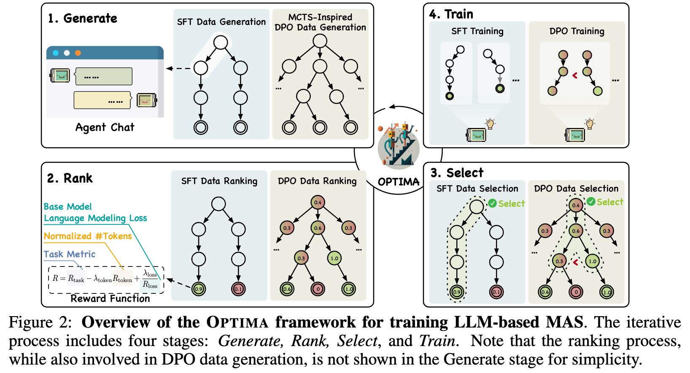

<p align="center">

</p>

<h1 align="center"> Optima: <u>Opti</u>mizing Effectiveness and Efficiency for LLM-Based <u>M</u>ulti-<u>A</u>gent Systems </h1>
<p align="center">
  [<a href="">Paper</a>] |
  [<a href="https://chenweize1998.github.io/optima-project-page/">Project Page</a>]
</p>

**Optima** is a novel training framework designed to optimize LLM-based multi-agent systems. By leveraging iterative training, Optima significantly enhances agent communication efficiency while boosting response accuracy. Our approach not only reduces token usage but also paves the way for improved inference-time scaling laws.



## 🚀 Key Features

- Significant reduction in token usage
- Substantial increase in communication effectiveness
- Potential for improved inference-time scaling laws
- Versatile training methods: iSFT, iDPO, and iSFT-DPO

## 🛠 Installation

Optima requires two conda environments: one for vLLM deployment and another for training, both using Python 3.11. Follow these steps to set up your environments:

### vLLM Environment

```bash
conda create -n optima-vllm python=3.11
# Install NVCC for CUDA
conda install nvidia/label/cuda-12.1.0::cuda-nvcc
# Install PyTorch 2.3.1 (required by VLLM==0.5.3)
conda install pytorch=2.3.1 torchvision torchaudio pytorch-cuda=12.1 -c pytorch -c nvidia
# Install VLLM 0.5.3
pip install vllm==0.5.3
```

### Training Environment

```bash
conda create -n optima-train python=3.11
# Install NVCC for CUDA
conda install nvidia/label/cuda-12.1.0::cuda-nvcc
# Install PyTorch 2.3.1 (required by VLLM==0.5.3)
conda install pytorch=2.3.1 torchvision torchaudio pytorch-cuda=12.1 -c pytorch -c nvidia
# Install Alignment Handbook (https://github.com/huggingface/alignment-handbook)
cd alignment-handbook
pip install -e .
# Install Dependencies
pip install flash-attn --no-build-isolation
pip install -r requirements.txt
```


## 🏃‍♂️ How to Run
We show how to run iSFT, iDPO, and iSFT-DPO settings on ARC-C dataset below. Changing the `training_config_path` to the desired config file in `train/${method}_recipes` will allow you to run the settings on other datasets. And the explanation to the config parameters can be found in the README files within the corresponding directories.

### iSFT Setting

Run the iSFT setting with:

```bash
MKL_THREADING_LAYER=GNU python sft_script.py \
    --train_config_path train/sft_recipes/arc.yaml \    # path to the training config file
    --vllm_env optima-vllm \        # conda environment name used for vllm deploy
    --alignment_env optima-train    # conda environment name used for training
```

### iDPO Setting

Execute the iDPO setting using:

```bash
MKL_THREADING_LAYER=GNU python dpo_script.py \
    --train_config_path train/dpo_recipes/arc.yaml \
    --vllm_env optima-vllm \
    --alignment_env optima-train
```

### iSFT-DPO Setting

Run the combined iSFT-DPO setting with:

```bash
MKL_THREADING_LAYER=GNU python sft_dpo_script.py \
    --train_config_path train/sft_dpo_recipes/arc.yaml \
    --vllm_env optima-vllm \
    --alignment_env optima-train
```

## 📊 Inference and Evaluation

### Inference Script

To get inference results for all models on a specified test set:

```bash
python inference_script.py \
    --model_root_path ./checkpoints/arc_sft \           # the root path of the checkpoint
    --tokenizer_path ${pretrained_tokenizer_path} \     # path to the pretrained tokenizer
    --dataset_type arc \                                # the dataset type, including hotpot_qa, mwh_qa, trival_qa, cbt, math, gsm8k, arc, mmlu
    --device 0 \                                        # gpu index for the first port number deployment
    --port 8000 \                                       # the first port number for model deployment
    --num_thread 128 \                                  # number of threads
    --output_root_path ./inference_results \            # the root path of output
    --vllm_env optima-vllm                              # conda environment used for vllm deploy
``` 

### Multi-Setting + Self-Consistency

For multi-agent setting with self-consistency:

- --model_path : the path of model
- --tokenizer_path : the path of tokenizer
- --device Device : device for the first port number deployment
- --port The first : port number for model deployment
- --dataset_type : the dataset type, including hotpot_qa, mwh_qa, trival_qa, cbt, math, gsm8k, arc, mmlu
- --num_thread : number of threads
- --output_path
- --temperature
- --vllm_env : conda environment used for vllm deploy

```bash
python multi_sc_data_generate_script.py \
    --model_path ./checkpoints/arc_sft/iteration_0 \    # path to the specific model
    --tokenizer_path ${pretrained_tokenizer_path} \     # path to the tokenizer 
    --device 0 \                                        # gpu index for the first port number deployment
    --port 8000 \                                       # the first port number for model deployment
    --dataset_type arc \                                # the dataset type, including hotpot_qa, mwh_qa, trival_qa, cbt, math, gsm8k, arc, mmlu
    --num_thread 128 \                                  # number of threads
    --output_path ./inference_results \                 # the root path of output
    --temperature 0.5 \                                 # temperature for sampling
    --vllm_env optima-vllm                              # conda environment used for vllm deploy
```

## ✍️ Citation
TODO
